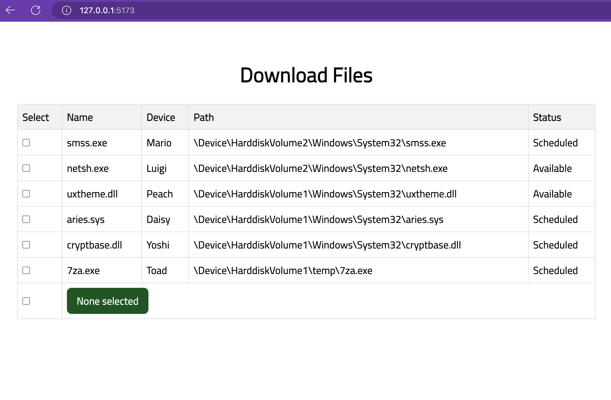
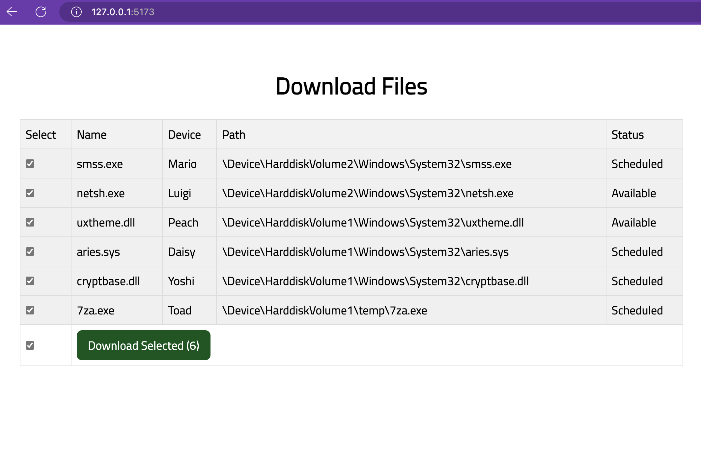
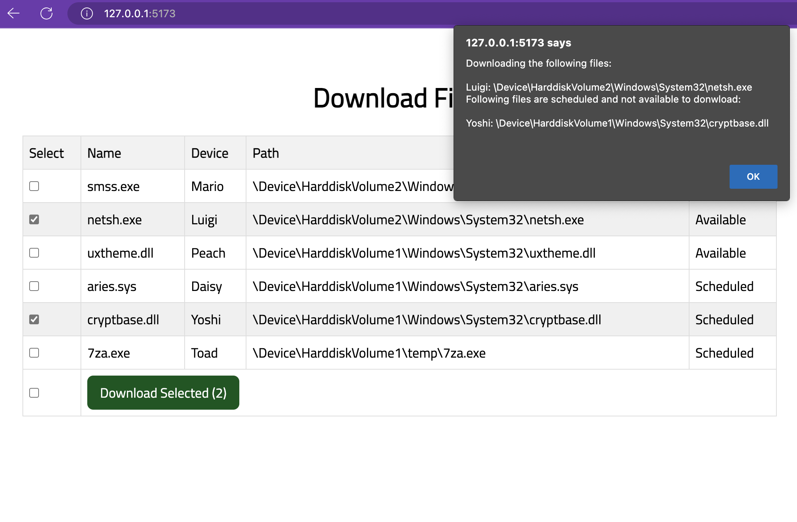

# UI Dev Assesment - React

## Instructions
- `npm install` to install the dependencies
- `npm run dev` to run the Application

## Component Structure:
- **App** (Main app compnent contanin filesList state and logic to handle download and selectAll files rendering FileList component)
    - **components/FileList** (Child component contain Table and logic to handle selection)

## Screenshots





## Requirments
A component displays a list of files which can be downloaded. It should be able to be given the following data:
```javascript
[

    {name: 'smss.exe', device: 'Mario', path: '\\Device\\HarddiskVolume2\\Windows\\System32\\smss.exe', status: 'scheduled'},

    {name: 'netsh.exe', device: 'Luigi', path: '\\Device\\HarddiskVolume2\\Windows\\System32\\netsh.exe', status: 'available'},

    {name: 'uxtheme.dll', device: 'Peach', path: '\\Device\\HarddiskVolume1\\Windows\\System32\\uxtheme.dll', status: 'available'},

    {name: 'aries.sys', device: 'Daisy', path: '\\Device\\HarddiskVolume1\\Windows\\System32\\aries.sys', status: 'scheduled'},

    {name: 'cryptbase.dll', device: 'Yoshi', path: '\\Device\\HarddiskVolume1\\Windows\\System32\\cryptbase.dll', status: 'scheduled'},

    {name: '7za.exe', device: 'Toad', path: '\\Device\\HarddiskVolume1\\temp\\7za.exe', status: 'scheduled'}

]
```
- Only those that have a status of "available" are currently able to be downloaded. Your implementation should manage this.

- The select-all checkbox should be in an unselected state if no items are selected.

- The select-all checkbox should be in a selected state if all items are selected.

- The select-all checkbox should be in an indeterminate state if some but not all items are selected.

- The "Selected 2" text should reflect the count of selected items and display "None Selected" when there are none selected.

- Clicking the select-all checkbox should select all items if none or some are selected.

- Clicking the select-all checkbox should de-select all items if all are currently selected.

- Status should be correctly formatted

- Clicking "Download Selected" when some or all items are displayed should generate an alert box with the path and device of all selected files.

- Precise/exact HTML formatting/styling to match the mockup is not required however rows should change colour when selected and on hover.
